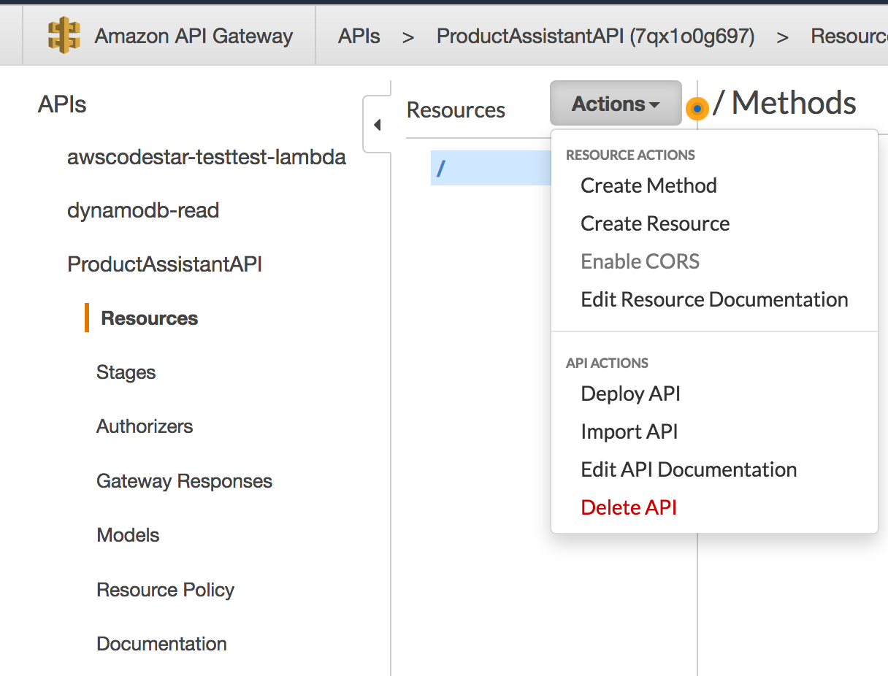
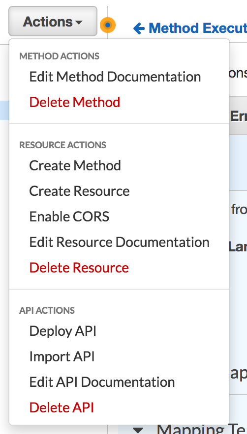

### 1. Create an IAM Role.

<details>
<summary><strong>Step-by-step instructions (expand for details)</strong></summary><p>
</p></details>
---

### 2. Create the lambda funciton.

<details>
<summary><strong>Step-by-step instructions (expand for details)</strong></summary><p>

1.  From the AWS console select **Lamnda** under the compute section.  Click on **Create Function**.  Select **Author from scratch**.  In the **Name** section give the function a unique name to your region.  The **Runtime** is **Python 3.6**.  In the **Role** section, select **Create a custome role** and you will be taken to a new screen.  For the **Existing role** choose the created role from step 1.


2.  In the new tab, for the **IAM Role** select the role created in section 1.  In **Policy Name**, select **Create a new Role Policy**.  Expand **View Polciy Document**.  Click on the blue **Edit** to the right of the text block.  Copy and paste Policy.json into the code block.  The policy is also copied below.  Click **Allow**.


```json
{
    "Version": "2012-10-17",
    "Statement": [
        {
            "Sid": "VisualEditor0",
            "Effect": "Allow",
            "Action": [
                "s3:PutObject",
                "s3:GetObject",
                "dynamodb:PutItem",
                "dynamodb:GetItem"
            ],
            "Resource": [
                "arn:aws:dynamodb:*:*:table/*",
                "arn:aws:s3:::*/*"
            ]
        },
        {
            "Sid": "VisualEditor1",
            "Effect": "Allow",
            "Action": [
                "rekognition:DetectText",
                "logs:CreateLogGroup",
                "logs:PutLogEvents",
                "logs:CreateLogStream"
            ],
            "Resource": "*"
        }
    ]
}
```

3.  Go back to the **Lambda Function** tab and click **Create function**.  Once the funciton is created, scroll to the **Function code** section like show below.  **Delete** the example function and copy and paste the code from Lambda.py.  The code is also shown below the image.  Click **save** and you should see no errors.


```python
"""
classes are upper camel
functions are lower camel
variables are lower case

Copyright (C) 2018: Edward Acosta and Alan Newcomer

This program is free software: you can redistribute it and/or modify
it under the terms of the GNU General Public License as published by
the Free Software Foundation, either version 3 of the License, or
(at your option) any later version.

This program is distributed in the hope that it will be useful,
but WITHOUT ANY WARRANTY; without even the implied warranty of
MERCHANTABILITY or FITNESS FOR A PARTICULAR PURPOSE.  See the
GNU General Public License for more details.

You should have received a copy of the GNU General Public License
along with this program.  If not, see <http://www.gnu.org/licenses/>
"""

import time
import json
import boto3
import botocore.vendored.requests.packages.urllib3 as urllib3
from urllib.parse import unquote

class ProductAssistant:
    """Initilize function to set boto3 clients and self variables."""
    def __init__(self, event, context):
        #setting text variables to False
        self.text_1 = False
        self.text_2 = False
        self.text_3 = False
        #rekognition and dynamodb client setup
        rek = boto3.client('rekognition')
        self.dynamodb = boto3.client('dynamodb')
        #converting event to json type
        self.message = json.loads(unquote(str(event)).replace("'","\""))
        print(self.message)
        self.number = self.message['From']
        #dynamodb tables
        self.product_table = "PA_Products"
        self.customer_table = "PA_Customers"
        #grabbing current state of text conversation
        found_product, textCount = self.getCurrentState()
        
        #if a new image comes in and it is the first message
        if 'MediaUrl0' in self.message.keys() and textCount == '0':
            s3_bucket, s3_key =self.uploadS3()
            rek_response = rek.detect_text(Image={
                'S3Object':{
                    'Bucket':s3_bucket,
                    'Name':s3_key
                }
            })
            self.word_list = self.getWords(rek_response)
            for each in self.word_list:
                getProduct = self.dynamodb.get_item(TableName=self.product_table, Key={
                    'product_id':{
                        'S':each.lower()
                    }
                }, ConsistentRead=True)
                if 'Item' in getProduct:
                    theProduct = getProduct['Item']['product_id']['S']
                    self.updateRow(self.number, 'textCount', 'N', str(int(textCount) + 1))
                    self.updateRow(self.number, 'product', 'S', theProduct)
                    productOptions = self.getDBList(each.lower())
                    self.text_1 = '<?xml version=\"1.0\" encoding=\"UTF-8\"?>'\
                        '<Response><Message>{0} {1} {2} .</Message></Response>'\
                        .format(theProduct, "was detected.\nWhould you like to see", productOptions)
                else:
                    print("did not find image")
        elif self.message['Body'] != '' and textCount == '1':
            getLink = self.dynamodb.get_item(TableName=self.product_table, Key={
                'product_id':{
                    'S':found_product.lower()
                }
            }, ConsistentRead=True)
            print(getLink)
            theLink = getLink['Item'][self.message['Body']]['S']
            self.updateRow(self.number, 'textCount', 'N', str(int(textCount) + 1))
            self.text_2 = '<?xml version=\"1.0\" encoding=\"UTF-8\"?>'\
                '<Response><Message>{0}</Message></Response>'.format(theLink)
        elif textCount == '2':
            self.text_3 = '<?xml version=\"1.0\" encoding=\"UTF-8\"?>'\
                '<Response><Message>{0}</Message></Response>'\
                .format("Send an image of a product so I can help you.")
        else:
            self.text_3 = '<?xml version=\"1.0\" encoding=\"UTF-8\"?>'\
                '<Response><Message>{0}</Message></Response>'\
                .format("Please re-send the text. No product found.")
    
    """Responds with the desired text message"""
    def textResponse(self):
        if self.text_1:
            return self.text_1
        elif self.text_2:
            return self.text_2
        elif self.text_3:
            return self.text_3

    """Creates a string list from the dynamodb options list"""
    def getDBList(self, product):
        getRow = self.dynamodb.get_item(TableName=self.product_table, Key={
            'product_id':{
                'S':product
            }
        }, ConsistentRead=True)
        getList = getRow['Item']['options']['L']
        for i in range(len(getList)):
            if i == 0:
                cleanList = '"' + getList[i]['S'] + '"'
            elif i < len(getList) -1:
                cleanList = cleanList + ", " + '"' + getList[i]['S'] + '"'
            else:
                cleanList = cleanList + " or " + '"' + getList[i]['S'] + '"'
        
        return cleanList
            
    """updates a row in dynamodb by getting and then putting"""     
    def updateRow(self, fromNum, key, kType, newValue):
        getJson = self.dynamodb.get_item(TableName=self.customer_table, Key={
            'from_number':{
                'S':fromNum
            }
        }, ConsistentRead=True)
        getJson['Item'][key][kType] = newValue
        self.dynamodb.put_item(TableName=self.customer_table, Item=getJson['Item'])
        return "Count Added"
    
    """Puts the words found by rekognition and appends to a list"""
    def getWords(self, response):   
        words = []
        textDetections=response['TextDetections']
        #print(response)
        print('Matching faces')
        for text in textDetections:
            print('Id: {}'.format(text['Id']))
            print('Detected text:' + text['DetectedText'])
            words.append(text['DetectedText'])
            print('Confidence: ' + "{:.2f}".format(text['Confidence']) + "%")
            print('')
            if 'ParentId' in text:
                print('Parent Id: {}'.format(text['ParentId']))
            print('Type:' + text['Type'])
            
        return words
    
    """uploads images to s3"""
    def uploadS3(self):
        s3 = boto3.client('s3')
        url = self.message['MediaUrl0']
        http = urllib3.PoolManager()
        bucket = 'sns-pictures' #your s3 bucket
        key = '{0}-{1}/{2}.jpg'.format(self.message['To'].replace('+',''),self.number.replace('+',''),url.split('/')[-1]) #your desired s3 path or filename
        s3_response = s3.upload_fileobj(http.request('GET', url,preload_content=False), bucket, key)
        return bucket, key
    
    """Inserts new row into dynamodb table"""
    def createRow(self, table_name, cell_number):
        response = self.dynamodb.put_item(TableName=table_name, Item={
            'from_number':{
                'S':cell_number
            },
            'textCount':{
                'N':'0'
            },
            'product':{
                'S':'none'
            },
            'timeStamp':{
                'N':str(time.time())
            }
        })
        count = '0'
        product = "none"
        return response, count, product

    """Gets information from dynamodb table to find current message state"""
    def getCurrentState(self):
        row_json = self.dynamodb.get_item(TableName=self.customer_table, Key={
            'from_number':{
                'S':self.number
            }
        }, ConsistentRead=True)
        #if a new image is sent then new information will be sent to dynamodb
        if 'MediaUrl0' in self.message.keys():
            _,count, product = self.createRow(self.customer_table, self.number)
        elif 'Item' not in row_json:
            #creating row if 'From' doesnt exist
            _,count, product = self.createRow(self.customer_table, self.number)
        elif float(row_json['Item']['timeStamp']['N']) < time.time() - 300:
            #creating new row in time is longer than five minutes
            _,count, product = self.createRow(self.customer_table, self.number)
        else:
            print(row_json)
            count = row_json['Item']['textCount']['N']
            product = row_json['Item']['product']['S']
            
        return product, count
        

def lambda_handler(event, context):
    print(event)
    twr = ProductAssistant(event, context)
    print(twr.textResponse())
    return twr.textResponse()

```
3.  Scroll down until you see **Basic settings** and change the memory to **1856 MB** and the **Timeout** to **30 sec**.  Click **save**.


4.  Your Lambda Function is **complete**.
</p></details>
---

### 3. Create an S3 bucket.

<details>
<summary><strong>Step-by-step instructions (expand for details)</strong></summary><p>
</p></details>
---

### 4. Create DynamoDB tables.

<details>
<summary><strong>Step-by-step instructions (expand for details)</strong></summary><p>
</p></details>
---

### 5. Create an Amazon API

Now that our Lambda function has been created and is working. There needs to be an API Gateway integration set up so Lambda can have a path to Twilio.

From API Gateway's Console and your choice of region (it doesn't need to match the Lambda function's region), select 'Create API':

<details>
<summary><strong>Step-by-step instructions (expand for details)</strong></summary><p>

1. From the AWS Management Console, choose **Services** then select **API Gateway**.


2. Create a new API. The API in this example is the name is **ProductAssistantAPI**.


4. In **Actions** click on **Create Resource**.



5. Enter a **Resource Name** and the **Resource Path** will be autofilled as the same.  Leave Configure as proxy resource and Enable API Gateway CORS as blank. Click **Create Resource**.


6. Click on the newly created resouce and click on **Actions**.  Select **Create Method**.


7. Select **Post** and click the **check mark**.  For integration type, select **Lambda Function**.  **Use Lambda Proxy integration** should be left unchecked.  The **Region** must be the same as the Product_Assistant Lambda function created earlier.  Select **Product_Assistant** as the **Lambda Function**.  Keep **Use Default Timeout**.  Hit save and accept the warning after it pops up.


8. Select the newly created **Post** and then click on **Integration Request**.  


9. Once opened, click on **Mapping Templates** at the bottom.  Change **Request body passthrough** to **When there are no templates defined (recommended)**.  Click on the ***plus symbole*** to **Add mapping template**.  Add **application/x-www-form-urlencoded**.  Click the check mark next to the inserted content.  Below, a content box will appear. 


10. Insert the below **code** into the content box.  This code was suggested by ***https://forums.aws.amazon.com/message.jspa?messageID=675886*** to split our HTTP parameters into JSON key/value pairs.

```
#set($httpPost = $input.path('$').split("&"))
{
#foreach( $kvPair in $httpPost )
 #set($kvTokenised = $kvPair.split("="))
 #if( $kvTokenised.size() > 1 )
   "$kvTokenised[0]" : "$kvTokenised[1]"#if( $foreach.hasNext ),#end
 #else
   "$kvTokenised[0]" : ""#if( $foreach.hasNext ),#end
 #end
#end
}
```

11. Scroll up to the top and click on the blue **Method Execution** link.**Twilio** expects a 200 HTTP status code of type **application/xml**.  Click on the **Integration Response**. Expand the **200** Method Response Status, then expand the 'Body Mapping Templates'.  If there is an 'application/json' entry, remove that now.


12. Click on **add mapping template** and insert **application/xml**. Click the check mark.  Enter the below **code** into the context box. This will allow only the Lambda return fuction to pass through.

```
#set($inputRoot = $input.path('$')) 
$inputRoot
```

13. Click on the **Actions** drop down and select **Deploy API**.  



14. Select a **New Stage* like **dev**.  Click on **Deploy**.


15.  Take note of the **Invoke URL**.  Your API is now complete.  Lets test it TODO.


 
</p></details>
---

### 6. Set up a Twilio SNS Project.


<details>
<summary><strong>Step-by-step instructions (expand for details)</strong></summary><p>
1.  Go to https://www.twilio.com/console/sms/dashboard and select **SMS** on the left hand side.  Create a new **Messaging Service** and select **Chat Bot/Interactive 2-Way**.


2.  Click the check box on the **Process Inbound Messages**.  Add the **Invoke** URL from the API step and instert it into the **Request URL** text block. 


3.  Click on **Numbers** on the left hand side.


4.  Add a number to your project.  You are now able to test **Product Assistant**.
</p></details>
---

**Product Assistant** is complete!

