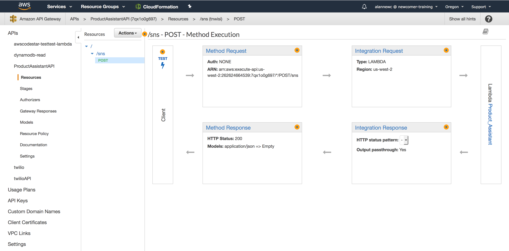

# Product Assistant Workshop

In this workshop you will deploy an application that receives a picture of a product, extracts the text from the picture and queries a NoSQL database against the text found. If the text matches an entry, it will send the user a message asking them about what kind of information they want to know about the product.

The application architecture uses [AWS Identity and Access Management (IAM)](https://aws.amazon.com/iam/), [Amazon DynamoDB](https://aws.amazon.com/dynamodb/), [Amazon Rekognition](https://aws.amazon.com/rekognition/), [Amazon S3](https://aws.amazon.com/s3/), [AWS Lambda](https://aws.amazon.com/lambda/), [Amazon API Gateway](https://aws.amazon.com/api-gateway/) and [Twilio](https://www.twilio.com/).

## Prerequisites

### AWS Account

In order to complete this workshop you will need an AWS Account with access to create AWS IAM, S3, DynamoDB, Lambda and API Gateway resources. The code and instructions in this workshop assume only one student is using a given AWS account at a time. If you try sharing an account with another student, you'll run into naming conflicts for certain resources. You can work around these by appending a unique suffix to the resources that fail to create due to conflicts, but the instructions do not provide details on the changes required to make this work.

All of the resources you will launch as part of this workshop are eligible for the AWS free tier if your account is less than 12 months old. See the [AWS Free Tier page](https://aws.amazon.com/free/) for more details.


### Region Selection

This workshop can be deployed in any AWS region that supports the following services:

- AWS Lambda
- Amazon API Gateway
- Amazon S3
- Amazon Rekognition
- Amazon DynamoDB

You can refer to the [region table](https://aws.amazon.com/about-aws/global-infrastructure/regional-product-services/) in the AWS documentation to see which regions have the supported services.

## Architecture Overview


----

### Implementation Instructions

Each of the following sections provides an implementation overview and detailed, step-by-step instructions. The overview should provide enough context for you to complete the implementation if you're already familiar with the AWS Management Console or you want to explore the services yourself without following a walkthrough.

### 1. Create an IAM Role for Your Lambda function

Every Lambda function has an IAM role associated with it. This role defines what other AWS services the function is allowed to interact with. For the purposes of this workshop, you'll need to create an IAM role that grants your Lambda function permission to write logs to Amazon CloudWatch Logs, access to write items to your DynamoDB table, access to read and write to S3 and access to rekognition.

#### Instructions

Use the IAM console to create a new role. Name it `PA_Lambda_Role` and select AWS Lambda for the role type.  There is no need to attach any policies, that will be completed in step 2.


<details>
<summary><strong>Step-by-step instructions (expand for details)</strong></summary><p>

1. From the AWS Management Console, click on **Services** and then select **IAM** in the Security, Identity & Compliance section.

2. Select **Roles** in the left navigation bar and then choose **Create new role**.

3. Select **Lambda** as service to use the role. Click **Next: Permissions**.

4. Dont add any permission policies and click **Next: Review**.

5. Give it the role name `PA_Lambda_Role` and click **Create Role**.


</p></details>

---

### 2. Create an Amazon DynamoDB Table

Use the Amazon DynamoDB console to create a two DynamoDB tables. You will call your first table `PA_customers` and give it a partition key called `from_number` with type String. The table name and partition key are case sensitive. Make sure you use the exact IDs provided. Use the defaults for all other settings. 

<details>
<summary><strong>Step-by-step instructions (expand for details)</strong></summary><p>

1. From the AWS Management Console, choose **Services** then select **DynamoDB** under Databases.

2. Choose **Create table**.

3. Enter ***PA_customers*** for the **Table name**. This field is case sensitive.

4. Enter ***from_number*** for the **Partition key** and select **String** for the key type. This field is case sensitive.

5. Check the **Use default settings** box and choose **Create**.


</p></details>

Your second table will be named 'PA-Products' and its partition key will be `product_id`. This table will require atleast on item to be inserted before Product Assistant can function.  Follow the instructions below:

<details>
<summary><strong>Step-by-step instructions (expand for details)</strong></summary><p>

1. From the AWS Management Console, choose **Services** then select **DynamoDB** under Databases.

2. Choose **Create table**.

3. Enter ***PA_Products*** for the **Table name**. This field is case sensitive.

4. Enter ***product_id*** for the **Partition key** and select **String** for the key type. This field is case sensitive.

5. Check the **Use default settings** box and choose **Create**.


6. Once the table is created, you have to create an item in it. This will act as a place to put product information. Select the **Items** tab and click on **Create item**. A new window will pop up.

7. Your first category will be your partition key. Enter the name of your first item here. We chose deeplens, but you can enter any value you want.

8. Click on the **+** symbol and select **Append** (adds to the bottom) or **Insert** (adds to the top). From there, select the data type **String**. A new value pair will appear. To the left, enter **user manual** for the key. To the right, enter https://aws.amazon.com/deeplens/faqs/ .

9. Repeat this process until you have entered all the items listed in the table below:

| Key (left box)      | Data Type       | Value (right box)                          |
|---------------------|-----------------|--------------------------------------------|
|blog                 | String          | https://aws.amazon.com/blogs/aws/deeplens/ |
|faqs                 | String          | https://aws.amazon.com/deeplens/faqs/      |
|options              | List            | **See Instructions below**                 |

10. Adding indexes to the list is similar to adding items, but you should make sure they are added to the list. To verify you're doing this correctly, you should confirm the List value is increasing every time you add an item. Below are the indexes of the **options** List:

| Key (left box)      | Data Type       | Value (right box)                          |
|---------------------|-----------------|--------------------------------------------|
|0                    | String          | blog                                       |
|1	              | String          | faqs                                       |
|2	              | List            | user manual                                |

11. Verify your items look like the image below:

</p></details>

---

### 3. Saving images to Amazon S3

In this section you'll configure an Amazon Simple Storage Service (S3)  bucket where your images will be saved for later analysis. Your bucket is the location where your uploaded images will gets stored for later analysis. 

#### Instructions

Use the console or AWS CLI to create an Amazon S3 bucket. Keep in mind that your bucket's name must be globally unique across all regions and customers. We recommend using a name like `product-assistant-firstname-lastname`. If you get an error that your bucket name already exists, try adding additional numbers or characters until you find an unused name.

<details>
<summary><strong>Step-by-step instructions (expand for details)</strong></summary><p>

1. In the AWS Management Console choose **Services** then select **S3** under Storage.

1. Choose **Create Bucket**

1. Provide a globally unique name for your bucket such as `product-assistant-firstname-lastname`.

1. Select the Region you've chosen to use for this workshop from the dropdown.

1. Choose **Create** in the lower left of the dialog without selecting a bucket to copy settings from.

    

#### Bucket Content

Leave the bucket empty for the time being. We will upload images into it later using Lambda.

#### Access to files uploaded

You can define who can access the content in your S3 buckets using a bucket policy. Bucket policies are JSON documents that specify what principals are allowed to execute various actions against the objects in your bucket.

#### Access to your bucket

By default, your bucket will only be accessible by authenticated users with access to your AWS account. We will keep it this way. 

</p></details>

---

### 4. Create the lambda function

AWS Lambda will do much of the heavy lifting in this application. It will track the status of the communication with Twilio, save the image to S3 and ensure Rekognition extracts text from the image. Additionally, it will query DynamoDB in search for word matches.

#### Instructions

Use the AWS Lambda console to create a new Lambda function called `lambda_function` that will handle image uploads. Use the provided code in the Step-by-step instructions.

Make sure to configure your function to use the `PA_Lambda_Role` IAM role you created in the previous section.

<details>
<summary><strong>Step-by-step instructions (expand for details)</strong></summary><p>

1.  From the AWS console select **Lambda** under the compute section.  Click on **Create Function**.  Select **Author from scratch**.  In the **Name** section give the function a unique name to your region.  The **Runtime** is **Python 3.6**.  In the **Role** section, select **Create a custom role** and you will be taken to a new screen.


2.  In the new tab, for the **IAM Role** select the role created in section 1.  In **Policy Name**, select **Create a new Role Policy**.  Expand **View Policy Document**.  Click on the blue **Edit** to the right of the text block.  Copy and paste Policy.json (also below) into the code block.  The policy is also copied below.  Click **Allow**.


```json
{
    "Version": "2012-10-17",
    "Statement": [
        {
            "Sid": "VisualEditor0",
            "Effect": "Allow",
            "Action": [
                "s3:PutObject",
                "s3:GetObject",
                "dynamodb:PutItem",
                "dynamodb:GetItem"
            ],
            "Resource": [
                "arn:aws:dynamodb:*:*:table/*",
                "arn:aws:s3:::*/*"
            ]
        },
        {
            "Sid": "VisualEditor1",
            "Effect": "Allow",
            "Action": [
                "rekognition:DetectText",
                "logs:CreateLogGroup",
                "logs:PutLogEvents",
                "logs:CreateLogStream"
            ],
            "Resource": "*"
        }
    ]
}
```

3.  Go back to the **Lambda Function** tab and click **Create function**.  Once the function is created, scroll to the **Function code** section like show below.  **Delete** the example function and copy and paste the code from Lambda.py (also below).  Do a word search for "your s3 bucket" and change the s3 bucket name to yours.  Click **save**.  You should see no errors.


```python
"""
classes are upper camel
functions are lower camel
variables are lower case

Copyright (C) 2018: Edward Acosta and Alan Newcomer

This program is free software: you can redistribute it and/or modify
it under the terms of the GNU General Public License as published by
the Free Software Foundation, either version 3 of the License, or
(at your option) any later version.

This program is distributed in the hope that it will be useful,
but WITHOUT ANY WARRANTY; without even the implied warranty of
MERCHANTABILITY or FITNESS FOR A PARTICULAR PURPOSE.  See the
GNU General Public License for more details.

You should have received a copy of the GNU General Public License
along with this program.  If not, see <http://www.gnu.org/licenses/>
"""

import time
import json
import boto3
import botocore.vendored.requests.packages.urllib3 as urllib3
from urllib.parse import unquote

class ProductAssistant:
    """Initilize function to set boto3 clients and self variables."""
    def __init__(self, event, context):
        #setting text variables to False
        self.text_1 = False
        self.text_2 = False
        self.text_3 = False
        #rekognition and dynamodb client setup
        rek = boto3.client('rekognition')
        self.dynamodb = boto3.client('dynamodb')
        #converting event to json type
        self.message = json.loads(unquote(str(event)).replace("'","\""))
        print(self.message)
        self.number = self.message['From']
        #dynamodb tables
        self.product_table = "PA_Products"
        self.customer_table = "PA_Customers"
        #grabbing current state of text conversation
        found_product, textCount = self.getCurrentState()
        
        #if a new image comes in and it is the first message
        if 'MediaUrl0' in self.message.keys() and textCount == '0':
            s3_bucket, s3_key =self.uploadS3()
            rek_response = rek.detect_text(Image={
                'S3Object':{
                    'Bucket':s3_bucket,
                    'Name':s3_key
                }
            })
            self.word_list = self.getWords(rek_response)
            for each in self.word_list:
                getProduct = self.dynamodb.get_item(TableName=self.product_table, Key={
                    'product_id':{
                        'S':each.lower()
                    }
                }, ConsistentRead=True)
                if 'Item' in getProduct:
                    theProduct = getProduct['Item']['product_id']['S']
                    self.updateRow(self.number, 'textCount', 'N', str(int(textCount) + 1))
                    self.updateRow(self.number, 'product', 'S', theProduct)
                    productOptions = self.getDBList(each.lower())
                    self.text_1 = '<?xml version=\"1.0\" encoding=\"UTF-8\"?>'\
                        '<Response><Message>{0} {1} {2} .</Message></Response>'\
                        .format(theProduct, "was detected.\nWhould you like to see", productOptions)
                else:
                    print("did not find image")
        elif self.message['Body'] != '' and textCount == '1':
            getLink = self.dynamodb.get_item(TableName=self.product_table, Key={
                'product_id':{
                    'S':found_product.lower()
                }
            }, ConsistentRead=True)
            print(getLink)
            theLink = getLink['Item'][self.message['Body']]['S']
            self.updateRow(self.number, 'textCount', 'N', str(int(textCount) + 1))
            self.text_2 = '<?xml version=\"1.0\" encoding=\"UTF-8\"?>'\
                '<Response><Message>{0}</Message></Response>'.format(theLink)
        elif textCount == '2':
            self.text_3 = '<?xml version=\"1.0\" encoding=\"UTF-8\"?>'\
                '<Response><Message>{0}</Message></Response>'\
                .format("Send an image of a product so I can help you.")
        else:
            self.text_3 = '<?xml version=\"1.0\" encoding=\"UTF-8\"?>'\
                '<Response><Message>{0}</Message></Response>'\
                .format("Please re-send the text. No product found.")
    
    """Responds with the desired text message"""
    def textResponse(self):
        if self.text_1:
            return self.text_1
        elif self.text_2:
            return self.text_2
        elif self.text_3:
            return self.text_3

    """Creates a string list from the dynamodb options list"""
    def getDBList(self, product):
        getRow = self.dynamodb.get_item(TableName=self.product_table, Key={
            'product_id':{
                'S':product
            }
        }, ConsistentRead=True)
        getList = getRow['Item']['options']['L']
        for i in range(len(getList)):
            if i == 0:
                cleanList = '"' + getList[i]['S'] + '"'
            elif i < len(getList) -1:
                cleanList = cleanList + ", " + '"' + getList[i]['S'] + '"'
            else:
                cleanList = cleanList + " or " + '"' + getList[i]['S'] + '"'
        
        return cleanList
            
    """updates a row in dynamodb by getting and then putting"""     
    def updateRow(self, fromNum, key, kType, newValue):
        getJson = self.dynamodb.get_item(TableName=self.customer_table, Key={
            'from_number':{
                'S':fromNum
            }
        }, ConsistentRead=True)
        getJson['Item'][key][kType] = newValue
        self.dynamodb.put_item(TableName=self.customer_table, Item=getJson['Item'])
        return "Count Added"
    
    """Puts the words found by rekognition and appends to a list"""
    def getWords(self, response):   
        words = []
        textDetections=response['TextDetections']
        #print(response)
        print('Matching faces')
        for text in textDetections:
            print('Id: {}'.format(text['Id']))
            print('Detected text:' + text['DetectedText'])
            words.append(text['DetectedText'])
            print('Confidence: ' + "{:.2f}".format(text['Confidence']) + "%")
            print('')
            if 'ParentId' in text:
                print('Parent Id: {}'.format(text['ParentId']))
            print('Type:' + text['Type'])
            
        return words
    
    """uploads images to s3"""
    def uploadS3(self):
        s3 = boto3.client('s3')
        url = self.message['MediaUrl0']
        http = urllib3.PoolManager()
        bucket = 'sns-pictures' #your s3 bucket
        key = '{0}-{1}/{2}.jpg'.format(self.message['To'].replace('+',''),self.number.replace('+',''),url.split('/')[-1]) #your desired s3 path or filename
        s3_response = s3.upload_fileobj(http.request('GET', url,preload_content=False), bucket, key)
        return bucket, key
    
    """Inserts new row into dynamodb table"""
    def createRow(self, table_name, cell_number):
        response = self.dynamodb.put_item(TableName=table_name, Item={
            'from_number':{
                'S':cell_number
            },
            'textCount':{
                'N':'0'
            },
            'product':{
                'S':'none'
            },
            'timeStamp':{
                'N':str(time.time())
            }
        })
        count = '0'
        product = "none"
        return response, count, product

    """Gets information from dynamodb table to find current message state"""
    def getCurrentState(self):
        row_json = self.dynamodb.get_item(TableName=self.customer_table, Key={
            'from_number':{
                'S':self.number
            }
        }, ConsistentRead=True)
        #if a new image is sent then new information will be sent to dynamodb
        if 'MediaUrl0' in self.message.keys():
            _,count, product = self.createRow(self.customer_table, self.number)
        elif 'Item' not in row_json:
            #creating row if 'From' doesnt exist
            _,count, product = self.createRow(self.customer_table, self.number)
        elif float(row_json['Item']['timeStamp']['N']) < time.time() - 300:
            #creating new row in time is longer than five minutes
            _,count, product = self.createRow(self.customer_table, self.number)
        else:
            print(row_json)
            count = row_json['Item']['textCount']['N']
            product = row_json['Item']['product']['S']
            
        return product, count
        

def lambda_handler(event, context):
    print(event)
    twr = ProductAssistant(event, context)
    print(twr.textResponse())
    return twr.textResponse()

```
3.  Scroll down until you see **Basic settings** and change the memory to **1856 MB** and the **Timeout** to **30 sec**.  Click **save**.


4.  Your Lambda Function is **complete**.
</p></details>

---

### 5. Create an Amazon API

Now that our Lambda function has been created and is working. There needs to be an API Gateway integration set up so Lambda can have a path to Twilio.

<details>
<summary><strong>Step-by-step instructions (expand for details)</strong></summary><p>

1. From the AWS Management Console, choose **Services** then select **API Gateway**.


2. Create a new API. The API in this example is the name is **ProductAssistantAPI**.


4. In **Actions** click on **Create Resource**.


5. Enter a **Resource Name** and the **Resource Path** will be autofilled as the same.  Leave Configure as proxy resource and Enable API Gateway CORS as blank. Click **Create Resource**.


6. Click on the newly created resource and click on **Actions**.  Select **Create Method**.


7. Select **Post** and click the **check mark**.  For integration type, select **Lambda Function**.  **Use Lambda Proxy integration** should be left unchecked.  The **Lambda Region** must be the same as the Product_Assistant Lambda function created earlier.  Select **Product_Assistant** as the **Lambda Function**.  Keep **Use Default Timeout**.  Hit save and accept the warning after it pops up.


8. Select the newly created **Post** and then click on **Integration Request**.  



9. Once opened, click on **Mapping Templates** at the bottom.  Change **Request body passthrough** to **When there are no templates defined (recommended)**.(Note: When no template matches the request might need to be selected if text messages do not go through.)  Click on the ***plus symbol*** to **Add mapping template**.  Add **application/x-www-form-urlencoded**.  Click the check mark next to the inserted content.  Below, a content box will appear. 


10. Insert the below **code** into the content box.  This code was suggested from ***https://forums.aws.amazon.com/message.jspa?messageID=675886*** to split our HTTP parameters into JSON key/value pairs.  Click **Save**.

```
#set($httpPost = $input.path('$').split("&"))
{
#foreach( $kvPair in $httpPost )
 #set($kvTokenised = $kvPair.split("="))
 #if( $kvTokenised.size() > 1 )
   "$kvTokenised[0]" : "$kvTokenised[1]"#if( $foreach.hasNext ),#end
 #else
   "$kvTokenised[0]" : ""#if( $foreach.hasNext ),#end
 #end
#end
}
```

11. Scroll up to the top and click on the blue **Method Execution** link.**Twilio** expects a 200 HTTP status code of type **application/xml**.  Click on the **Integration Response**. Expand the **200** Method Response Status, then expand the 'Body Mapping Templates'.  If there is an 'application/json' entry, remove that now.


12. Click on **add mapping template** and insert **application/xml**. Click the check mark.  Enter the below **code** into the context box. This will allow only the Lambda return function to pass through.

```
#set($inputRoot = $input.path('$')) 
$inputRoot
```

13. Click the **Method Response** link.  Under **Response Body for 200**, if `application/json` is defined, remove it.  Add `application/xml` with an `Empty` model and click the **Check Mark**.

14. Click on the **Actions** drop down and select **Deploy API**.  


15. Select **New Stage**, write a **Stage name** like dev.  Click on **Deploy**.


16. Take note of the **Invoke URL**.  Your API is now complete.


 
</p></details>

---

### 6. Receiving and sending messages with Twilio

In this module you'll configure Twilio, an API that allows you to interact with your customers via SMS/MMS. In subsequent modules, you will configure Amazon API Gateway and AWS Lambda to load that image into a S3 bucket. Once the image reaches the S3 bucket, another Lambda function will process the image using Amazon Rekognition to extract words from the image and query DynamoDB in search of those words.

If you already have a Twilio account, this section can be skipped.


#### Sign up for Twilio Account

In the spirit of full disclosure, Twilio is a pay-as-you-go tool. We decided to use it because its functionality met our use case. If you happen to know about another tool that has the same functionality for free, please email the repo's owners and they will update the information on the repo after testing your suggestions. Any charges incurred by people and teams using Twilio are the responsibility of the tester. The creators of this repo will not be held responsible for any charges incurred by testers of this application.

<details>
<summary><strong>Step-by-step instructions (expand for details)</strong></summary><p>

1. Navigate to [Twilio](https://www.twilio.com/)'s page and click on the [Sign Up](https://www.twilio.com/try-twilio) button.

2. Enter your information

3. Use the drop-down arrow to select your programming language.

4. Check the box next to the phrase "I'm not a robot".

5. Click on the **Get Started** button in the lower left. This will bring up a new page.

6. In the new page, enter your phone number and click the **Verify** button. This will bring up a new page.

7. You will receive text with a verification code. Enter this code in the page where you were registering.

8. Log into your Twilio account.

</p></details>

---

### 7. Setting up a Twilio SNS Project

<details>
<summary><strong>Step-by-step instructions (expand for details)</strong></summary><p>

1.  Go to this [Twilio Link](https://www.twilio.com/console/sms/dashboard) and select **SMS** on the left hand side.  Create a new **Messaging Service** and select **Chat Bot/Interactive 2-Way**.


2.  Click the check box on the **Process Inbound Messages**.  Add the **Invoke** URL from the API step and insert it into the **Request URL** text block.  Make sure the path includes the **Post** (/sns). 


3.  Click on **Numbers** on the left hand-side.


4.  Add a number to your project and text a picture that has the word **DeepLens** (like below) to the number you added.


</p></details>

---

**Product Assistant** is complete!

